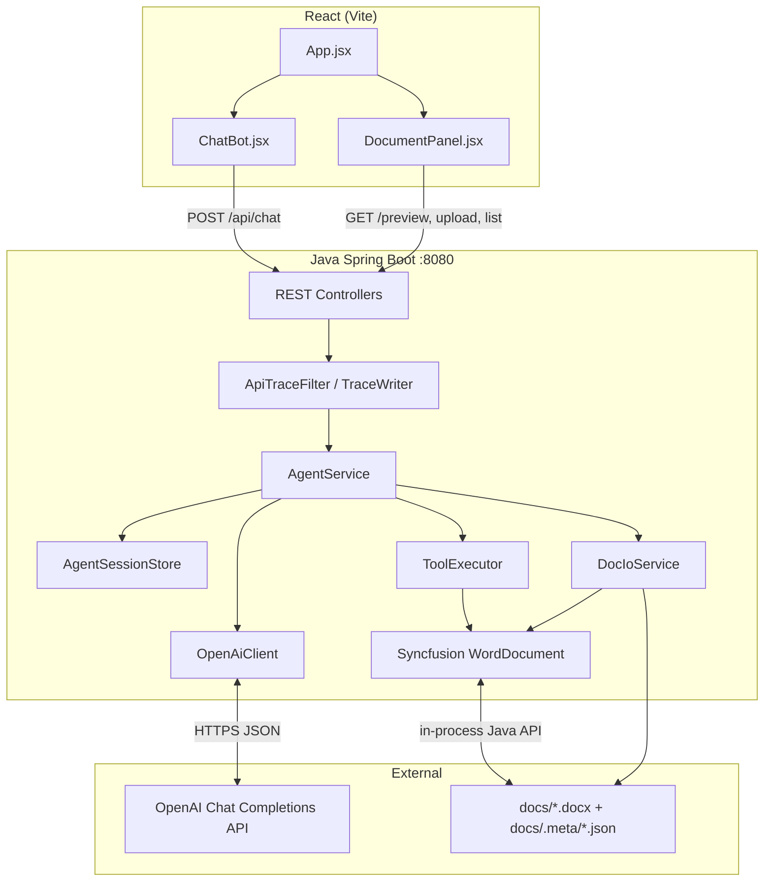
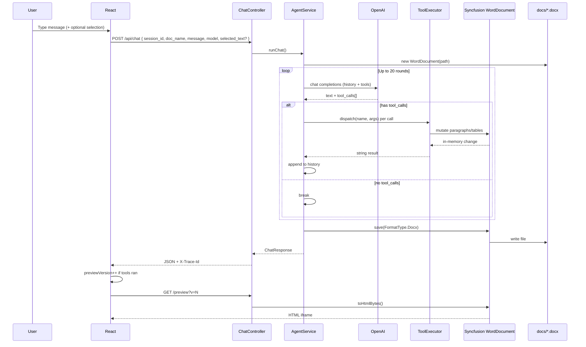

# Document Assistant — Architecture

The app is a **split-pane document assistant**: chat on the left, Word preview on the right. The React frontend talks only to a **Java Spring Boot** API (`doc-agent-server`, port 8080). The AI agent runs on the server; **Syncfusion DocIO** is a server-side Java library — the LLM never calls Syncfusion directly.



---

## Frontend design

The UI is intentionally slim: **no in-browser Word editor** (the old Syncfusion Rich Text Editor was removed). Preview is read-only HTML in an iframe.

### Layout and state (`App.jsx`)

| State | Purpose |
|-------|---------|
| `messages` | Chat history (UI only; server also keeps LLM history) |
| `selectedDoc` | Active `.docx` filename |
| `selectionText` | Text highlighted in preview iframe |
| `model` | OpenAI model id (default `gpt-4o-mini`) |
| `previewVersion` | Cache-bust counter; bumped after tool edits |
| `SESSION_ID` | UUID in `localStorage` — ties multi-turn agent memory |

### Components

**`ChatBot.jsx`** — model picker, selection box, message list, collapsible tool-call details, per-round change summary (`round_summary`), Activity panel (`GET /api/traces`).

**`DocumentPanel.jsx`** — document list, upload (drag-drop), create, download, preview iframe.

**`apiClient.js`** — thin `fetch` wrapper; reads `X-Trace-Id` from responses for debugging.

### Selection bridge (preview → chat)

The backend injects a script into preview HTML. When the user highlights text in the iframe, it posts a message to the parent window:

```javascript
// Injected into preview HTML by DocumentController
window.parent.postMessage({ type: 'docgen-selection', text: selectedText }, '*');
```

`DocumentPanel` listens and updates `selectionText`, which is sent on the next chat message as `selected_text`.

### What the frontend does *not* do

- No direct OpenAI calls
- No `.docx` parsing or editing
- No use of `preview_html` from chat responses (preview reloads via iframe URL only)

### API base URL

`VITE_API_BASE` is written to `frontend/.env.local` by `start-java.ps1` / `start-java.sh`. Fallback: `http://localhost:8080`.

---

## Backend design

Spring Boot app under `doc-agent-server/`. Main packages:

| Package | Role |
|---------|------|
| `api/` | REST endpoints (`ChatController`, `DocumentController`, `TraceController`) |
| `agent/` | Agent loop, tools, prompts, session store |
| `llm/` | `OpenAiClient` → OpenAI Chat Completions |
| `docio/` | File storage, upload validation, HTML export |
| `trace/` | Per-request operation tracing to `logs/traces/` |
| `config/` | CORS, Syncfusion license, `application.yml` |

### Document storage (folder database)

```
doc-agent-server/docs/
  report.docx
  report-2.docx          # auto-renamed on duplicate upload
  .meta/
    report.docx.json     # uploaded_at, updated_at, size, source
```

`DocIoService` validates uploads by opening them with Syncfusion, saves bytes to disk, and maintains metadata via `DocumentStore`.

### Configuration (`application.yml`)

| Key | Default | Purpose |
|-----|---------|---------|
| `app.docs-dir` | `docs` | Document folder |
| `app.openai-api-key` | `${OPENAI_API_KEY}` | From repo-root `.env` |
| `app.default-model` | `gpt-4o-mini` | Model when client omits `model` |
| `app.max-tool-rounds` | `20` | Max LLM ↔ tool loops per chat turn |
| `app.trace-dir` | `logs/traces` | Operation trace output |
| `app.trace-enabled` | `true` | Enable `ApiTraceFilter` |

### Cross-cutting: operation tracing

`ApiTraceFilter` wraps every `/api/*` request:

1. Opens a trace folder: `logs/traces/<timestamp>_<kind>_<traceId>/`
2. Sets response headers: `X-Trace-Id`, `X-Trace-Dir`
3. Writes `request.json`, `response.json`, `operations.jsonl`, doc snapshots, LLM round artifacts

The agent records LLM rounds, tool dispatches, and before/after `.docx` copies inside the same trace session.

Trace folder layout (typical chat request):

```
logs/traces/20260622T183110_chat_c54930c5/
  meta.json
  request.json
  response.json
  operations.jsonl
  snapshots/
    before.docx
    after.docx
  llm/
    round-0-history-size.json
    round-0-response.json
    round-1-response.json
    ...
```

---

## Agent loop (core backend flow)

One user message → one `AgentService.runChat()` call, which may involve **multiple LLM round-trips** (up to `max-tool-rounds`).

```
1. Load session history from AgentSessionStore
2. Append user message (optionally wrapped with selected_text)
3. Open WordDocument from disk (Syncfusion) — held open for entire turn
4. LOOP (max 20 rounds):
     a. Send history + tool schemas → OpenAI
     b. If model returns tool_calls → ToolExecutor.dispatch() on live WordDocument
     c. Append assistant + tool results to history
     d. Break when model returns no tool_calls
5. document.save() back to .docx
6. Return ChatResponse (reply, tool_calls, round_summary, trace_id)
```

Important: **one `WordDocument` instance per chat turn**. All tool calls in that turn mutate the same in-memory object; save happens once at the end.

### System prompt rules (`AgentPrompts.SYSTEM`)

- Always call `read_document` first each turn
- Use positional tools (`insert_paragraph`) for section-aware edits
- Re-read document after multiple index-changing edits
- Tables: `read_table` for coordinates, `set_table_cell` or `replace_text` for edits

---

## Communication payloads between layers

### 1. Frontend → Backend (REST)

#### `POST /api/chat` — main agent request

**Request:**

```json
{
  "session_id": "4fff1096-4ffb-41b0-9784-03a74c132cea",
  "doc_name": "report.docx",
  "message": "Add a dot at the end of each line in this table",
  "model": "gpt-4o-mini",
  "selected_text": "optional — text highlighted in preview"
}
```

**Response:**

```json
{
  "reply": "Added trailing dots to all table cells in table 0.",
  "tool_calls": [
    {
      "name": "set_table_cell",
      "args": { "table_index": 0, "row": 0, "col": 1, "text": "Item A." },
      "result": "Updated table[0] row 0 col 1 → \"Item A.\"."
    }
  ],
  "preview_html": "",
  "preview_version": 1,
  "trace_id": "c54930c5",
  "round_summary": {
    "trace_id": "c54930c5",
    "document": "report.docx",
    "change_count": 14,
    "summary_text": "• Update table[0] cell [0][1]\n• ...",
    "changes": [
      { "tool": "set_table_cell", "description": "...", "result": "..." }
    ],
    "document_saved": true,
    "has_snapshots": true
  }
}
```

**Response headers:** `X-Trace-Id`, `X-Trace-Dir`

#### Document APIs

| Endpoint | Request | Response |
|----------|---------|----------|
| `GET /api/documents` | — | `{ documents: [{ name, size_bytes, uploaded_at, ... }], storage_dir }` |
| `POST /api/documents/upload` | `multipart/form-data` file | `{ saved_as, original_filename, renamed }` |
| `POST /api/documents` | `{ "name": "draft.docx" }` | `{ "name": "draft.docx" }` |
| `GET /api/documents/{name}/preview?v=N` | — | `text/html` (Syncfusion HTML + selection script) |
| `GET /api/documents/{name}/download` | — | raw `.docx` bytes |
| `DELETE /api/sessions/{id}` | — | `{ "cleared": "..." }` |
| `GET /api/models` | — | `{ "models": ["gpt-4o", "gpt-4o-mini", ...] }` |
| `GET /api/traces` | — | `{ traces: [...] }` |
| `GET /api/traces/{id}` | — | trace metadata + operations |
| `GET /api/traces/{id}/summary` | — | human-readable round summary |

---

### 2. AgentService → OpenAI (`OpenAiClient`)

**HTTP:** `POST https://api.openai.com/v1/chat/completions`

**Body shape:**

```json
{
  "model": "gpt-4o-mini",
  "messages": [
    { "role": "system", "content": "<AgentPrompts.SYSTEM>" },
    { "role": "user", "content": "Please add a dot..." },
    {
      "role": "assistant",
      "content": "",
      "tool_calls": [
        {
          "id": "call_abc",
          "type": "function",
          "function": {
            "name": "read_document",
            "arguments": "{}"
          }
        }
      ]
    },
    {
      "role": "tool",
      "tool_call_id": "call_abc",
      "content": "[0] (Normal) Intro...\n[TABLE 0] (5 rows × 3 cols)\n..."
    }
  ],
  "tools": [
    {
      "type": "function",
      "function": {
        "name": "read_document",
        "description": "Read the full document structure...",
        "parameters": { "type": "object", "properties": {} }
      }
    },
    {
      "type": "function",
      "function": {
        "name": "set_table_cell",
        "description": "Replace the text of one table cell...",
        "parameters": {
          "type": "object",
          "properties": {
            "table_index": { "type": "integer" },
            "row": { "type": "integer" },
            "col": { "type": "integer" },
            "text": { "type": "string" }
          },
          "required": ["table_index", "row", "col", "text"]
        }
      }
    }
  ]
}
```

**OpenAI response (parsed by `OpenAiClient`):**

```json
{
  "choices": [{
    "message": {
      "content": "I'll update each cell now.",
      "tool_calls": [{
        "id": "call_xyz",
        "function": {
          "name": "set_table_cell",
          "arguments": "{\"table_index\":0,\"row\":0,\"col\":1,\"text\":\"Hello.\"}"
        }
      }]
    }
  }]
}
```

Mapped internally to `ChatTurn(text, List<ToolCall>)` where each `ToolCall` has `id`, `name`, `JsonNode args`.

---

### 3. Agent internal session history (`AgentSessionStore`)

In-memory `ConcurrentHashMap<sessionId, List<Map>>`. Not identical to OpenAI format — `OpenAiClient.buildMessages()` translates it.

| Stored entry | Shape |
|--------------|-------|
| User turn | `{ "role": "user", "content": "..." }` |
| Assistant turn | `{ "role": "assistant", "content": "...", "tool_calls": [{ "id", "name", "args" }] }` |
| Tool results | `{ "role": "tool_batch", "responses": [{ "id", "name", "content" }] }` |

Tool `content` sent back to the LLM may be **truncated** (`read_document` → 12k chars, `read_table` → 8k) while the full result is kept in traces and `tool_calls` in the HTTP response.

---

### 4. OpenAI tool call → Syncfusion (`ToolExecutor`)

This is the **agent ↔ Syncfusion boundary**. Payload is **not JSON over the wire** — it is an in-process Java dispatch:

```
Input:  toolName (String) + args (JsonNode)
Output: result (String) — plain text for the LLM
```

| Tool | JSON args (from LLM) | Syncfusion operations | String result (back to LLM) |
|------|---------------------|----------------------|----------------------------|
| `read_document` | `{}` | Walk sections/body via `DocumentSnapshot.render()` | `"[0] (Normal) text...\n[TABLE 0] (3×4)\n  row 0: [...]"` |
| `read_table` | `{ "table_index": 0 }` | `WTable` → iterate rows/cells | `"Table 0: 5 rows × 3 cols\n  [0][0]: \"...\""` |
| `replace_text` | `{ "find": "foo", "replace": "bar" }` | `document.replace(find, replace, false, false)` | `"Replaced 3 occurrence(s)..."` |
| `append_paragraph` | `{ "text": "...", "style": "Heading 1" }` | `section.addParagraph()`, `appendText()`, `applyStyle()` | `"Appended paragraph at index 12."` |
| `insert_paragraph` | `{ "index": 5, "text": "...", "style": "Normal" }` | Insert `WParagraph` into `WTextBody.getChildEntities()` | `"Inserted paragraph at index 5."` |
| `set_paragraph` | `{ "index": 3, "text": "...", "style": "..." }` | Clear + rewrite paragraph at index | `"Updated paragraph at index 3."` |
| `delete_paragraph` | `{ "index": 3 }` | `body.getChildEntities().removeAt(...)` | `"Deleted paragraph at index 3."` |
| `set_table_cell` | `{ "table_index": 0, "row": 1, "col": 2, "text": "x." }` | `WTableCell` → clear/set `WParagraph` text | `"Updated table[0] row 1 col 2 → \"x.\""` |

**Syncfusion object model used:**

```
WordDocument
  └── Sections → WSection
        └── Body (WTextBody)
              └── ChildEntities[]
                    ├── IWParagraph / WParagraph
                    └── WTable
                          └── Rows → WTableRow → Cells → WTableCell → paragraphs
```

After all tools in the turn: `document.save(docPath, FormatType.Docx)`.

**Available paragraph styles** (via `DocumentSnapshot.applyStyle`): Normal, Title, Heading 1–3, List Bullet, List Number, Quote.

---

### 5. Syncfusion for preview (separate path from agent)

Preview does **not** go through the agent. `DocumentController` → `DocIoService.toHtmlBytes()`:

```java
WordDocument document = new WordDocument(docPath);
document.save(outputStream, FormatType.Html);  // Syncfusion HTML export
// + inject selection postMessage script
```

The frontend loads this as:

```
GET /api/documents/{name}/preview?v={previewVersion}
```

`previewVersion` increments after chat tool calls so the iframe reloads the updated file.

---

## End-to-end sequence (one chat message)



---

## Design choices

1. **Server-side editing only** — The LLM edits via structured tools, not raw OOXML. Changes are safe and traceable but less expressive than a full editor (e.g. one cell at a time vs. rich formatting).

2. **Session memory on server** — `session_id` preserves multi-turn context for the agent. Clearing chat in the UI calls `DELETE /api/sessions/{id}`.

3. **Stable indices** — `DocumentSnapshot` assigns 0-based paragraph and table indices across the document body so the LLM can target content predictably.

4. **Tracing is orthogonal** — Every API call gets a trace folder; the agent adds LLM rounds, tool I/O, and doc snapshots inside it.

5. **No Syncfusion in the browser** — Syncfusion appears only in Java (DocIO). The frontend sees HTML preview and JSON API responses.

6. **Performance notes** — LLM round-trips dominate latency. `preview_html` is omitted from chat responses; preview is loaded separately. Tool results are truncated when re-sent to the LLM to keep context smaller.

---

## Source file map

| Concern | Path |
|---------|------|
| Chat orchestration | `doc-agent-server/src/main/java/com/docgen/agent/AgentService.java` |
| Tool → DocIO mapping | `doc-agent-server/src/main/java/com/docgen/agent/ToolExecutor.java` |
| Tool schemas for OpenAI | `doc-agent-server/src/main/java/com/docgen/agent/ToolDefinitions.java` |
| Document text model | `doc-agent-server/src/main/java/com/docgen/agent/DocumentSnapshot.java` |
| System prompt | `doc-agent-server/src/main/java/com/docgen/agent/AgentPrompts.java` |
| Session store | `doc-agent-server/src/main/java/com/docgen/agent/AgentSessionStore.java` |
| OpenAI HTTP client | `doc-agent-server/src/main/java/com/docgen/llm/OpenAiClient.java` |
| File + HTML I/O | `doc-agent-server/src/main/java/com/docgen/docio/DocIoService.java` |
| REST — chat | `doc-agent-server/src/main/java/com/docgen/api/ChatController.java` |
| REST — documents | `doc-agent-server/src/main/java/com/docgen/api/DocumentController.java` |
| Operation tracing | `doc-agent-server/src/main/java/com/docgen/trace/` |
| Frontend shell | `frontend/src/App.jsx` |
| Frontend chat UI | `frontend/src/components/ChatBot.jsx` |
| Frontend document UI | `frontend/src/components/DocumentPanel.jsx` |
| API client | `frontend/src/utils/apiClient.js` |
| Config | `doc-agent-server/src/main/resources/application.yml` |

---

## Related docs

- `docs/AI_AGENT_IMPLEMENTATION_PLAN.md` — phased implementation plan
- `docs/JAVA_DOCIO_PLAN.md` — Java/Syncfusion backend plan
- `docs/VERSION_CONTROL_PLAN.md` — planned doc versioning (not yet implemented)
