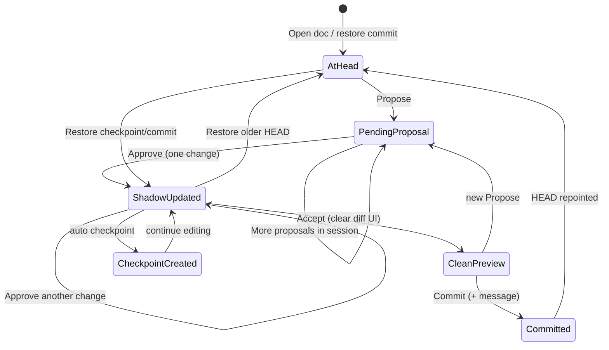
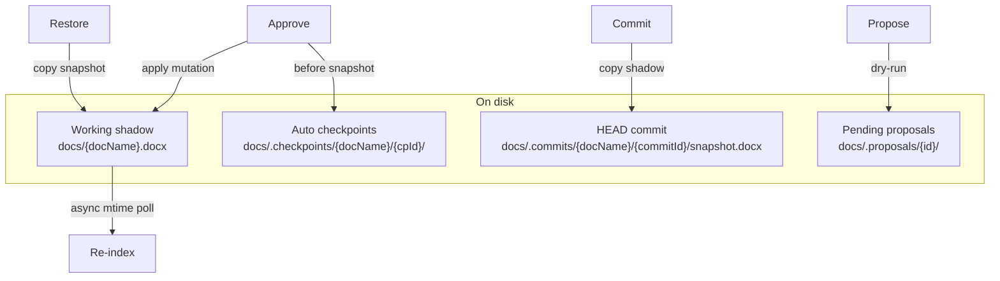

# docx4j Agent Server — Recovery & Copilot UX Stages

**Project folder:** `docx4j-agent-server/`  
**Builds on:** [`DOCX4J_IMPLEMENTATION_STAGES.md`](DOCX4J_IMPLEMENTATION_STAGES.md) (Stages S0–S7 complete)  
**Design references:** [`MUTATION_CONTRACT_DESIGN.md`](MUTATION_CONTRACT_DESIGN.md)

---

## How to use this document

Each step has a unique id: **`R{stage}.{step}`** (e.g. `R1.3`).

When requesting implementation, say:

> *Implement through **R1.4** and run all tests listed for Stage R1.*

Rules:

1. **Do not skip steps** within a stage unless the doc says optional.
2. **Stop at the checkpoint** — run automated + manual tests before continuing.
3. **Recover before stress testing** — multi-doc load tests are *Later* until startup provides real fixtures.
4. **Defer** anything marked *Later* unless explicitly requested.

### Stage map (at a glance)

| Stage | Id range | Theme | Stop after this to have… |
|-------|----------|-------|---------------------------|
| R0 | R0.1–R0.5 | HEAD + commits + checkpoints | Git-like snapshots; restore API |
| R1 | R1.1–R1.6 | Preview diffs + approve/accept | Red/green pending overlay; per-change apply |
| R2 | R2.1–R2.4 | History timeline + restore UI | User can rewind to any checkpoint/commit |
| R3 | R3.1–R3.3 | Commit UX | Named commits; download; HEAD pointer |
| R4 | R4.1–R4.5 | Preview edit + async re-index | Inline block edit; background index refresh |
| R5 | R5.1–R5.3 | Error recovery polish | Stale-target recovery; busy/idle rules |
| R* | R*.L | *Later* | Multi-doc stress runner, scoped LLM context |

---

## Concepts (Copilot-like model)

| Term | Meaning |
|------|---------|
| **HEAD** | Latest **committed** snapshot (`commit_id` + message). Recoverable and downloadable. |
| **Shadow / working doc** | Live file `docs/{docName}.docx`. All **approved** AI changes and **user edits** land here. |
| **Propose** | AI or manual batch creates a **pending** change. Shadow unchanged; preview shows overlay. |
| **Approve** | User OKs **one** change (or one diff row) → apply to shadow → **auto checkpoint**. |
| **Accept** | Clears red/green diff highlights for the session. Single change: can merge with Approve (one click). |
| **Commit** | User names a milestone → copy shadow → new HEAD snapshot + `commit_id`. |
| **User edit** | Direct edit in preview → apply to shadow; block marked as edited (no old/new pair). |
| **Re-index** | Async rebuild of structural index from current shadow; **must not block** AI propose/approve. |

### State flow



### Storage layout (per document)



**Design decisions (locked for R0–R3):**

- One physical working file per doc (`docs/{name}.docx`) is the shadow; no separate staging copy unless *Later* branch experiments.
- **Checkpoint** = automatic snapshot after every Approve (and user edit in R4).
- **Commit** = explicit user action with message; repoints HEAD; downloadable.
- **Accept** = UI-only cleanup of diff highlights; does not change shadow content.
- Restoring a checkpoint/commit while pending proposals exist → **reject pending** (with confirm dialog in UI).

---

## Prerequisites (before R0.1)

- [ ] Stages **S0–S7** implemented (`mvn -f docx4j-agent-server test` green)
- [ ] Server runs on port **8081** with at least one doc in `docs/` (e.g. XYZ training doc)
- [ ] Existing proposal workflow works: `POST /api/proposals` → approve/reject
- [ ] Read this doc §Concepts and [`DOCX4J_IMPLEMENTATION_STAGES.md`](DOCX4J_IMPLEMENTATION_STAGES.md) Stage 5 (ProposalStore)

---

## Stage R0 — HEAD, commits, and checkpoints (foundation)

**Goal:** Git-like commit storage and auto checkpoints on approve; restore API without new UI yet.

### R0.1 — CommitStore + models

**Work:**

- `com.docgen.recovery.CommitMeta` — `commitId`, `docName`, `message`, `parentCommitId`, `createdAt`, `author` (optional)
- `com.docgen.recovery.CommitStore`
  - Path: `docs/.commits/{docName}/{commitId}/`
  - Files: `snapshot.docx`, `meta.json`
  - `create(docName, message, byte[] snapshot)` → `CommitMeta`
  - `getHead(docName)` → optional `CommitMeta`
  - `setHead(docName, commitId)` — pointer in `docs/.commits/{docName}/HEAD`
  - `list(docName)` — newest first
  - `loadSnapshot(docName, commitId)` → bytes

**Files:**

```
docx4j-agent-server/src/main/java/com/docgen/recovery/
├── CommitMeta.java
├── CommitStore.java
└── HeadPointer.java          # read/write HEAD file
```

**Tests:**

| Id | Test class | Pass criteria |
|----|------------|---------------|
| TR0.1 | `CommitStoreTest` | Save snapshot + meta → round-trip load |
| TR0.2 | `CommitStoreTest` | `setHead` / `getHead` returns latest commit id |
| TR0.3 | `CommitStoreTest` | `list` returns commits newest-first |

**Done when:** TR0.1–TR0.3 pass.

---

### R0.2 — CheckpointStore

**Work:**

- `com.docgen.recovery.CheckpointMeta` — `checkpointId`, `docName`, `proposalId` (nullable), `changeSummary`, `createdAt`
- `com.docgen.recovery.CheckpointStore`
  - Path: `docs/.checkpoints/{docName}/{checkpointId}/`
  - Files: `snapshot.docx`, `meta.json`
  - `create(docName, snapshot, meta)` → `CheckpointMeta`
  - `list(docName)` — newest first
  - `loadSnapshot(docName, checkpointId)` → bytes

**Tests:**

| Id | Test class | Pass criteria |
|----|------------|---------------|
| TR0.4 | `CheckpointStoreTest` | Save/load snapshot round-trip |
| TR0.5 | `CheckpointStoreTest` | List ordering newest-first |

**Done when:** TR0.4–TR0.5 pass.

---

### R0.3 — DocumentWorkspace service

**Work:**

- `com.docgen.recovery.DocumentWorkspace`
  - Resolves shadow path via existing `DocumentLoader`
  - `ensureInitialCommit(docName)` — if no HEAD, copy current shadow → commit `"Initial import"`
  - `commit(docName, message)` — copy shadow → new commit, repoint HEAD
  - `restoreCommit(docName, commitId)` — copy commit snapshot → shadow, repoint HEAD
  - `restoreCheckpoint(docName, checkpointId)` — copy checkpoint → shadow (HEAD unchanged until user commits)
  - `createCheckpointOnApprove(docName, proposalId, beforeBytes)` — called from ProposalService

**Tests:**

| Id | Test class | Pass criteria |
|----|------------|---------------|
| TR0.6 | `DocumentWorkspaceTest` | `ensureInitialCommit` creates HEAD when missing |
| TR0.7 | `DocumentWorkspaceTest` | `commit` then shadow bytes equal committed snapshot |
| TR0.8 | `DocumentWorkspaceTest` | `restoreCommit` rewinds shadow to older commit |
| TR0.9 | `DocumentWorkspaceTest` | `restoreCheckpoint` restores shadow without moving HEAD |

**Done when:** TR0.6–TR0.9 pass.

---

### R0.4 — Wire approve → checkpoint

**Work:**

- In `ProposalService.approve`: before apply, save `before.docx` to checkpoint store (reuse existing bytes from proposal)
- After successful apply, optionally link checkpoint to `proposalId`
- On `openDoc` / first index request: call `ensureInitialCommit`

**Tests:**

| Id | Test class | Pass criteria |
|----|------------|---------------|
| TR0.10 | `ProposalServiceTest` | Approve creates exactly one new checkpoint |
| TR0.11 | `ProposalServiceTest` | Checkpoint snapshot matches pre-approve working doc |

**Done when:** TR0.10–TR0.11 pass.

---

### R0.5 — Recovery REST API

**Work:**

- `com.docgen.api.RecoveryController`
  - `GET /api/documents/{name}/commits` — list + current HEAD id
  - `POST /api/documents/{name}/commits` — body `{ "message": "..." }` → create commit
  - `GET /api/documents/{name}/commits/{commitId}/download` — snapshot bytes
  - `GET /api/documents/{name}/checkpoints` — list checkpoints
  - `POST /api/documents/{name}/restore/commit/{commitId}`
  - `POST /api/documents/{name}/restore/checkpoint/{checkpointId}`
  - Restore endpoints: call `proposalService.rejectAllPending(docName)` before restore

**Tests:**

| Id | Test | Pass criteria |
|----|------|---------------|
| TR0.12 | `RecoveryControllerTest` `@WebMvcTest` or `@SpringBootTest` | POST commit returns 200 + commit id |
| TR0.13 | `RecoveryControllerTest` | GET download returns valid docx bytes |
| TR0.14 | `RecoveryControllerTest` | Restore commit rejects pending proposals |
| TR0.15 | Manual curl | Commit → modify → restore → shadow matches commit |

**Done when:** TR0.12–TR0.15 pass.

---

### Stage R0 checkpoint ✓

```bash
mvn -f docx4j-agent-server test
mvn -f docx4j-agent-server spring-boot:run

# Initial commit bootstrap (automatic on first access) or explicit:
curl -X POST http://localhost:8081/api/documents/XYZ-Training-and-Instruction-Program.docx/commits \
  -H "Content-Type: application/json" \
  -d '{"message":"Baseline"}'

curl http://localhost:8081/api/documents/XYZ-Training-and-Instruction-Program.docx/commits
```

**Verify:**

- [ ] `docs/.commits/{docName}/HEAD` points to latest commit
- [ ] Each approve creates a checkpoint under `docs/.checkpoints/`
- [ ] Downloaded commit opens correctly in Word
- [ ] Restore rewinds shadow; pending proposals cleared

**Stop phrase:** *Implemented through R0.5.*

---

## Stage R1 — Preview diffs + approve/accept

**Goal:** Pending changes visible in preview (old red, new green); per-change approve; session accept clears highlights.

### R1.1 — EditSession model

**Work:**

- `com.docgen.proposal.EditSession` — `sessionId`, `docName`, `createdAt`, `acceptedAt` (nullable)
- `EditSessionStore` — in-memory or file under `docs/.sessions/{sessionId}.json`
- `POST /api/proposals` attaches new proposals to active session (create session if none)
- `POST /api/documents/{name}/sessions/accept` — marks session accepted; pending overlay cleared in UI

**Tests:**

| Id | Test class | Pass criteria |
|----|------------|---------------|
| TR1.1 | `EditSessionStoreTest` | Create session; attach proposal ids |
| TR1.2 | `EditSessionStoreTest` | Accept sets `acceptedAt`; new propose starts new session |

**Done when:** TR1.1–TR1.2 pass.

---

### R1.2 — Preview overlay API

**Work:**

- Extend `DocumentPreviewService` or add `PreviewOverlayService`
  - `renderHtml(docName, overlayMode)` where `overlayMode` = `none` | `pending`
  - For `pending`: load shadow HTML; for each **PENDING** proposal diff, wrap affected `data-dg-id` blocks:
    - **Old text:** `<span class="dg-diff-old">…</span>` (red)
    - **New text:** `<span class="dg-diff-new">…</span>` (green)
  - Insert/delete: block-level red (deleted) or green (inserted) placeholders
- `GET /api/documents/{name}/preview?overlay=pending`

**Tests:**

| Id | Test class | Pass criteria |
|----|------------|---------------|
| TR1.3 | `PreviewOverlayServiceTest` | Modify diff injects old+new spans for target id |
| TR1.4 | `PreviewOverlayServiceTest` | Approved proposals not shown in pending overlay |
| TR1.5 | Manual | Preview iframe shows red/green for pending propose |

**Done when:** TR1.3–TR1.5 pass.

---

### R1.3 — Per-change approve (partial batch)

**Work:**

- Extend `Proposal` or add `ProposalChange` rows: each mutation/diff has `changeId`, status `PENDING|APPROVED|REJECTED`
- `POST /api/proposals/{id}/approve/{changeId}` — apply **one** mutation to shadow; checkpoint; mark change approved
- `POST /api/proposals/{id}/approve-all` — apply remaining pending changes in order
- Keep `POST /api/proposals/{id}/approve` as approve-all for backward compat
- After partial approve: refresh preview overlay (only unapproved diffs remain highlighted)

**Tests:**

| Id | Test class | Pass criteria |
|----|------------|---------------|
| TR1.6 | `ProposalServiceTest` | Approve one of three changes → only that block changes on disk |
| TR1.7 | `ProposalServiceTest` | Approve remaining → all changes applied |
| TR1.8 | `ProposalServiceTest` | Reject single change leaves others pending |
| TR1.9 | `GoldenModifyTest` | Partial approve matches expected intermediate text |

**Done when:** TR1.6–TR1.9 pass.

---

### R1.4 — Preview + Proposals UI

**Work:**

- `style.css`: `.dg-diff-old` (red strikethrough/bg), `.dg-diff-new` (green bg)
- `app.js`:
  - Load preview with `?overlay=pending` when pending proposals exist
  - Per-diff **Approve** / **Reject** buttons in Proposals panel
  - **Approve all** and **Accept** (clear highlights) buttons
  - Single pending change: one button **Approve & apply** (approve + accept combined)
  - After approve: flash changed `data-dg-id` in preview

**Tests:**

| Id | Test | Pass criteria |
|----|------|---------------|
| TR1.10 | Manual UI | Propose AI edit → preview shows red/green before approve |
| TR1.11 | Manual UI | Approve one diff → shadow updates; other diffs still highlighted |
| TR1.12 | Manual UI | Accept → highlights gone; text stays as approved |
| TR1.13 | Functional test runner | Existing XYZ runner still passes (update to per-change approve if needed) |

**Done when:** TR1.10–TR1.13 pass.

---

### R1.5 — Conversation grouping

**Work:**

- Proposals panel groups by `session_id`
- Show session status: `reviewing` | `accepted`
- Log activity: "Session accepted — N changes applied"

**Tests:**

| Id | Test | Pass criteria |
|----|------|---------------|
| TR1.14 | Manual | Two proposes in same session → one Accept clears all overlays |
| TR1.15 | Manual | After Accept, new propose starts new session group |

**Done when:** TR1.14–TR1.15 pass.

---

### R1.6 — Preview sync rules

**Work:**

- Preview always renders from **shadow** (current `docs/{name}.docx`)
- Pending overlay is computed from dry-run / stored diffs, not from mutating shadow
- Document in API response: `shadow_mtime`, `head_commit_id`

**Tests:**

| Id | Test | Pass criteria |
|----|------|---------------|
| TR1.16 | `ProposalServiceTest` | Propose does not change shadow file mtime |
| TR1.17 | Manual | Propose → download docx → file unchanged until approve |

**Done when:** TR1.16–TR1.17 pass.

---

### Stage R1 checkpoint ✓

```bash
mvn -f docx4j-agent-server test
# UI: http://localhost:8081 — hard refresh Ctrl+F5

# 1. AI propose a one-line change → preview red/green
# 2. Approve → download → Word shows new text
# 3. Accept → preview clean
# 4. Multi-mutation propose → approve one-by-one → accept
```

**Verify:**

- [ ] Shadow unchanged on propose; changed only on approve
- [ ] Old text red, new text green for pending diffs
- [ ] Per-change approve works; approve-all works
- [ ] Accept removes highlights only

**Stop phrase:** *Implemented through R1.6.*

---

## Stage R2 — History timeline + restore UI

**Goal:** User can see checkpoints and commits and restore any point.

### R2.1 — History API aggregation

**Work:**

- `GET /api/documents/{name}/history` — merged timeline: commits + checkpoints, newest first
  - Entry: `{ "type": "commit"|"checkpoint", "id", "label", "created_at", "is_head" }`

**Tests:**

| Id | Test | Pass criteria |
|----|------|---------------|
| TR2.1 | `RecoveryControllerTest` | History includes both commits and checkpoints |
| TR2.2 | `RecoveryControllerTest` | HEAD commit marked `is_head: true` |

**Done when:** TR2.1–TR2.2 pass.

---

### R2.2 — History panel (UI)

**Work:**

- Sidebar **History** tab: timeline list
- Actions per entry: **Restore**, **Download** (commits only)
- HEAD badge on current commit
- "Uncommitted changes" badge when shadow ≠ HEAD (byte compare or hash)

**Tests:**

| Id | Test | Pass criteria |
|----|------|---------------|
| TR2.3 | Manual UI | Timeline shows checkpoints after each approve |
| TR2.4 | Manual UI | Restore checkpoint → preview + index refresh |
| TR2.5 | Manual UI | Restore commit → HEAD moves; pending rejected |

**Done when:** TR2.3–TR2.5 pass.

---

### R2.3 — Restore confirm + reject pending

**Work:**

- Confirm dialog: "Restore will discard N pending proposals"
- On restore: `rejectAllPending`, copy snapshot, re-index, clear preview overlay cache

**Tests:**

| Id | Test class | Pass criteria |
|----|------------|---------------|
| TR2.6 | `DocumentWorkspaceTest` | Restore with pending proposals → all rejected |
| TR2.7 | Manual | After restore, index matches restored content |

**Done when:** TR2.6–TR2.7 pass.

---

### R2.4 — Functional test runner integration

**Work:**

- Dev runner reset: optional restore to named commit `"Baseline"` instead of only golden file copy
- Document in `docs/XYZ-FUNCTIONAL_TEST_PROMPTS.md`

**Tests:**

| Id | Test | Pass criteria |
|----|------|---------------|
| TR2.8 | Manual UI runner | Reset → run test 1 → pass → history shows checkpoint |

**Done when:** TR2.8 passes.

---

### Stage R2 checkpoint ✓

**Stop phrase:** *Implemented through R2.4.*

---

## Stage R3 — Commit UX

**Goal:** Explicit user commits with message; HEAD repointed; downloadable artifact.

### R3.1 — Commit dialog (UI)

**Work:**

- **Commit** button in doc toolbar (enabled when shadow ≠ HEAD or always)
- Modal: message input (required), preview of change count since last commit
- On success: refresh HEAD badge, history, download link

**Tests:**

| Id | Test | Pass criteria |
|----|------|---------------|
| TR3.1 | Manual UI | Commit with message → appears at top of history |
| TR3.2 | Manual UI | Download commit → opens in Word; matches current shadow |
| TR3.3 | Manual | After commit, "uncommitted" badge clears |

**Done when:** TR3.1–TR3.3 pass.

---

### R3.2 — Commit policy

**Work:**

- `DocumentWorkspace.commit`: snapshot shadow, set HEAD, record parent chain
- Optional: reject commit if pending proposals exist (return 409) — **recommended**

**Tests:**

| Id | Test class | Pass criteria |
|----|------------|---------------|
| TR3.4 | `DocumentWorkspaceTest` | Commit with pending proposals → 409 or auto-reject (document chosen behavior) |
| TR3.5 | `DocumentWorkspaceTest` | Parent commit id linked correctly |

**Done when:** TR3.4–TR3.5 pass.

---

### R3.3 — Upload bootstrap commit

**Work:**

- On `POST /api/documents/upload`: after save, `ensureInitialCommit` with message `"Upload"`

**Tests:**

| Id | Test | Pass criteria |
|----|------|---------------|
| TR3.6 | Manual | Upload new doc → history shows initial commit |

**Done when:** TR3.6 passes.

---

### Stage R3 checkpoint ✓

```bash
# Edit → approve → commit "v1.1" → download commit → restore pre-commit checkpoint → commit again
```

**Verify:**

- [ ] Every commit is downloadable and recoverable
- [ ] HEAD always points to latest commit
- [ ] Commit message stored in meta.json

**Stop phrase:** *Implemented through R3.3.*

---

## Stage R4 — Preview edit + async re-index

**Goal:** User edits blocks in preview; edits marked distinctly; background re-index without blocking AI.

### R4.1 — Block edit API

**Work:**

- `POST /api/documents/{name}/blocks/{targetId}/edit` — body `{ "new_text": "..." }`
  - Build single `modify` mutation (`old_text` from current index)
  - Apply to shadow via `MutationApplier`
  - Auto checkpoint with `source: "user_edit"`
  - Return updated block descriptor

**Tests:**

| Id | Test class | Pass criteria |
|----|------------|---------------|
| TR4.1 | `BlockEditControllerTest` | Edit updates shadow text |
| TR4.2 | `BlockEditControllerTest` | Stale `old_text` → 409 with refresh hint |
| TR4.3 | `BlockEditControllerTest` | Checkpoint created on edit |

**Done when:** TR4.1–TR4.3 pass.

---

### R4.2 — Preview contenteditable

**Work:**

- Preview iframe: `contenteditable="true"` on elements with `data-dg-id` (paragraph/cell text only)
- Debounced save (e.g. 800 ms) → block edit API
- CSS `.dg-user-edited` — subtle border/background (no red/green pair)
- Track edited ids in session for overlay

**Tests:**

| Id | Test | Pass criteria |
|----|------|---------------|
| TR4.4 | Manual UI | Click paragraph in preview → edit → save → download matches |
| TR4.5 | Manual UI | User-edited block shows mark; no old/new diff colors |
| TR4.6 | Manual | Edit table cell text → correct cell changes in Word |

**Done when:** TR4.4–TR4.6 pass.

---

### R4.3 — IndexScheduler (async)

**Work:**

- `com.docgen.index.IndexScheduler` — `@Scheduled(fixedDelay = 45_000)` or configurable `app.reindex-interval-ms`
  - For each open doc or all docs in `docs/`: if mtime changed since last index AND not busy → queue re-index
- `com.docgen.index.IndexBusyGate` — set during propose/approve/edit API; re-index skips until cleared
- Re-index: `BookmarkIndexer.ensureBookmarks` + save if new bookmarks + rebuild index cache

**Tests:**

| Id | Test class | Pass criteria |
|----|------------|---------------|
| TR4.7 | `IndexSchedulerTest` | mtime change triggers re-index when idle |
| TR4.8 | `IndexSchedulerTest` | Re-index skipped while `IndexBusyGate` held |
| TR4.9 | `IndexSchedulerTest` | Catch-up re-index runs once after busy released |

**Done when:** TR4.7–TR4.9 pass.

---

### R4.4 — External Word edit detection

**Work:**

- If shadow mtime changes without server API (user edited in desktop Word): mark doc `externally_modified`
- UI banner: "Document changed on disk — re-index now?"
- Manual `POST /api/documents/{name}/reindex` (existing ↻ button)

**Tests:**

| Id | Test | Pass criteria |
|----|------|---------------|
| TR4.10 | Manual | Save doc in Word while server running → banner within 60 s |
| TR4.11 | Manual | Re-index → blocks list matches Word content |

**Done when:** TR4.10–TR4.11 pass.

---

### R4.5 — AI priority under load

**Work:**

- Propose/approve holds busy gate for entire LLM + apply duration
- Re-index runs on executor thread pool (never block HTTP worker)
- Log slow re-index (>2 s) at debug

**Tests:**

| Id | Test | Pass criteria |
|----|------|---------------|
| TR4.12 | Manual | AI propose during re-index → propose completes without timeout |
| TR4.13 | Manual | Re-index eventually catches up after AI finishes |

**Done when:** TR4.12–TR4.13 pass.

---

### Stage R4 checkpoint ✓

**Stop phrase:** *Implemented through R4.5.*

---

## Stage R5 — Error recovery polish

**Goal:** Graceful handling of stale targets, approve failures, and restore edge cases.

### R5.1 — Stale target recovery

**Work:**

- On approve/edit 409: UI offers **Re-propose** (fresh index to LLM) or **Refresh index**
- `ProposalService`: detect hash mismatch before apply; return structured error `{ "code": "STALE_TARGET", "target_id", "current_text" }`

**Tests:**

| Id | Test class | Pass criteria |
|----|------------|---------------|
| TR5.1 | `ProposalServiceTest` | Stale old_text returns STALE_TARGET without mutating shadow |
| TR5.2 | Manual | Simulated stale propose → re-propose succeeds |

**Done when:** TR5.1–TR5.2 pass.

---

### R5.2 — Approve failure rollback

**Work:**

- If apply fails mid-batch (partial approve): shadow restored from checkpoint taken at start of that approve call
- Proposal change status remains `PENDING`

**Tests:**

| Id | Test class | Pass criteria |
|----|------------|---------------|
| TR5.3 | `ProposalServiceTest` | Failed apply leaves shadow unchanged |
| TR5.4 | `ProposalServiceTest` | Checkpoint from failed attempt not listed as restorable (or marked failed) |

**Done when:** TR5.3–TR5.4 pass.

---

### R5.3 — Recovery E2E scenario doc

**Work:**

- Add `docs/RECOVERY_E2E_CHECKLIST.md` — step-by-step manual QA script
- Cover: propose → partial approve → accept → commit → restore → user edit → external Word edit

**Tests:**

| Id | Test | Pass criteria |
|----|------|---------------|
| TR5.5 | Manual | Complete checklist on XYZ doc without errors |

**Done when:** TR5.5 passes.

---

### Stage R5 checkpoint ✓

**Stop phrase:** *Implemented through R5.3* — **Recovery MVP complete.**

---

## Stage R* — Later (out of Recovery MVP)

Implement only when explicitly requested.

| Step | Id | Feature | Notes |
|------|-----|---------|-------|
| R*.1 | Multi-doc stress runner | 10 docx batch; propose/approve latency metrics |
| R*.2 | Scoped LLM context | Focus + keyword + neighbors; full-doc fallback |
| R*.3 | Branch experiments | Second shadow copy for what-if edits |
| R*.4 | Table row insert/delete | Required for some compliance templates |
| R*.5 | PDF export | LibreOffice or cloud converter |
| R*.6 | Format strict guard | Detect formatting-only collateral changes |

---

## Test commands reference

```bash
# All unit tests
mvn -f docx4j-agent-server test

# Recovery-related tests only (after R0)
mvn -f docx4j-agent-server test -Dtest=CommitStoreTest,CheckpointStoreTest,DocumentWorkspaceTest,RecoveryControllerTest,PreviewOverlayServiceTest

# Run server
mvn -f docx4j-agent-server spring-boot:run

# Commits
curl http://localhost:8081/api/documents/{name}/commits
curl -X POST http://localhost:8081/api/documents/{name}/commits \
  -H "Content-Type: application/json" -d '{"message":"v1.1"}'

# History
curl http://localhost:8081/api/documents/{name}/history

# Preview with pending overlay
curl "http://localhost:8081/api/documents/{name}/preview?overlay=pending"

# Restore
curl -X POST http://localhost:8081/api/documents/{name}/restore/checkpoint/{cpId}
curl -X POST http://localhost:8081/api/documents/{name}/restore/commit/{commitId}

# Functional tests (dev UI)
# http://localhost:8081 → Functional tests panel
python docx4j-agent-server/scripts/functional_test_runner.py
```

---

## Fixture / document checklist

| Asset | Stage needed | Description |
|-------|--------------|-------------|
| `docs/XYZ-Training-and-Instruction-Program*.docx` | R1+ | Primary manual QA doc |
| `src/test/resources/fixtures/single-paragraph.docx` | R0 | Commit/restore unit tests |
| `src/test/resources/golden/modify-cell/*` | R1 | Partial approve tests |
| `docs/xyz-functional-tests.json` | R2 | UI runner + history integration |
| Local multi-run paragraph fixture | R1 | Preview diff styling |

---

## Suggested implementation requests (copy-paste)

| Goal | Request |
|------|---------|
| Foundation only | *Implement through **R0.5** and run Stage R0 checkpoint.* |
| Copilot preview diffs | *Implement through **R1.6** and run Stage R1 checkpoint.* |
| History + restore UI | *Implement through **R2.4** and run Stage R2 checkpoint.* |
| Commits UX | *Implement through **R3.3** and run Stage R3 checkpoint.* |
| Preview edit + re-index | *Implement through **R4.5** and run Stage R4 checkpoint.* |
| Recovery MVP | *Implement through **R5.3** and run Stage R5 checkpoint.* |

---

## Estimated effort (focused implementation)

| Stage | Scope | Rough effort |
|-------|--------|--------------|
| R0 | Stores + API | 2–3 days |
| R1 | Preview diffs + partial approve | 3–4 days |
| R2 | History UI | 2 days |
| R3 | Commit UX | 1–2 days |
| R4 | Preview edit + scheduler | 3–5 days |
| R5 | Recovery polish | 2 days |

**Total Recovery MVP:** ~2 weeks focused, or ~1 week if R4 (preview edit) is deferred.

---

## Related documents

| Doc | Contents |
|-----|----------|
| [`DOCX4J_IMPLEMENTATION_STAGES.md`](DOCX4J_IMPLEMENTATION_STAGES.md) | Core mutation engine, proposals, LLM (S0–S7) |
| [`MUTATION_CONTRACT_DESIGN.md`](MUTATION_CONTRACT_DESIGN.md) | JSON schema, ID-based modify |
| [`XYZ-FUNCTIONAL_TEST_PROMPTS.md`](XYZ-FUNCTIONAL_TEST_PROMPTS.md) | XYZ functional test catalog |
| `docs/xyz-functional-tests.json` | Automated test definitions |
| `docx4j-agent-server/src/main/java/com/docgen/proposal/ProposalStore.java` | Existing proposal + before.docx persistence |
