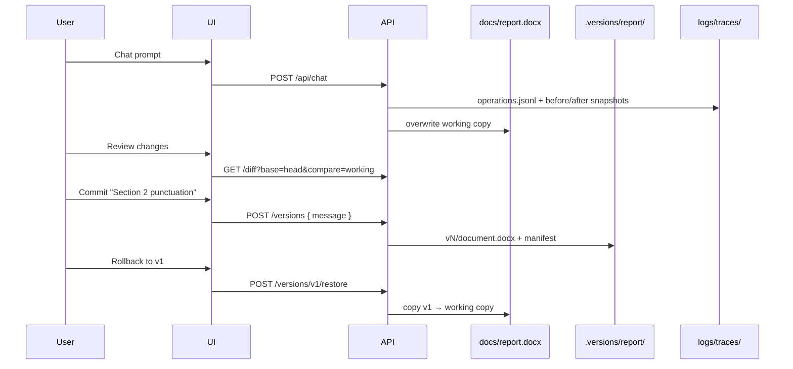

# Version Control Plan — Word-like Commits & Rollback

Branch: `feature/java-docio-backend`  
Prerequisite: **Operation tracing** (`com.docgen.trace`) — implemented in Phase 1 below.

---

## 1. Goal

Give users a **Microsoft Word–style** workflow:

1. Edit document via AI (auto-saved to `docs/<name>.docx`)
2. **Review** a diff of what changed since the last commit
3. **Commit** a named version (checkpoint)
4. **Rollback** to any prior commit
5. See **every operation** that led to the current state (audit trail)

No SQL — continue using the **folder database**, extended with a version store.

---

## 2. What we have today (Phase 1 — done)

### Reusable trace module (`com.docgen.trace`)

| Component | Role |
|-----------|------|
| `OperationType` | Canonical event types (extensible enum) |
| `OperationTraceSession` | One folder per run; append-only `operations.jsonl` |
| `TraceWriter` | Opens sessions, manages `logs/traces/` root |
| `OperationRecorder` | Record from anywhere; reads session from HTTP request |
| `ApiTraceFilter` | Auto-traces every `/api/*` call; sets `X-Trace-Id` header |

### Per-request trace folder

```
logs/traces/
  20260622T153045.123Z_chat_a1b2c3d4/
    meta.json              # trace_id, kind, status, duration, summary
    operations.jsonl       # chronological ops (source of truth)
    request.json           # inbound HTTP body
    response.json          # outbound JSON (preview_html truncated if huge)
    snapshots/
      before.docx          # document before agent turn
      after.docx           # document after agent turn
    llm/
      round-0-response.json
      round-1-response.json
```

### Log file

All operations also emit to **`logs/app.log`** via logger `com.docgen.trace.OPERATION`:

```
[trace:a1b2c3d4] #3 TOOL_DISPATCH | replace_text
```

### API

| Method | Path | Purpose |
|--------|------|---------|
| GET | `/api/traces` | List recent traces |
| GET | `/api/traces/{traceId}` | Trace meta + full `operations.jsonl` |

Disable tracing: `app.trace-enabled: false` in `application.yml`.

---

## 3. Target architecture (Phase 2–4)

```
docs/
  report.docx                    ← working copy (always latest)
  .meta/report.docx.json         ← upload metadata
  .versions/report/                ← NEW version store
    manifest.json                  ← ordered commit list
    v1/
      document.docx
      meta.json                    ← message, author, parent, trace_id
      operations.jsonl             ← copy or link from agent trace
    v2/
      ...
logs/traces/                       ← raw HTTP/agent traces (already exists)
```

**Principles**

- **Working copy** = `docs/<name>.docx` (what preview + agent edit)
- **Commit** = immutable snapshot + metadata + operation log
- **Trace** = fine-grained audit; **version** = user-visible checkpoint
- Every commit stores `trace_id` linking back to `logs/traces/...`

---

## 4. Phase 2 — Version store (backend)

**Estimate: 3–4 days**

| Task | Description |
|------|-------------|
| V1 | `VersionStore.java` — `commit(docName, message, traceId)`, `listCommits`, `getCommit` |
| V2 | On commit: copy `docs/<name>.docx` → `.versions/<name>/vN/document.docx` |
| V3 | Append to `manifest.json`: `{ id, label, created_at, parent, trace_id, operation_count }` |
| V4 | `GET /api/documents/{name}/versions` — list commits |
| V5 | `POST /api/documents/{name}/versions` — create commit `{ message }` |
| V6 | `POST /api/documents/{name}/versions/{id}/restore` — rollback working copy |

**Reuse:** `OperationRecorder.openStandalone("version_commit", …)` wraps commit API.

---

## 5. Phase 3 — Diff before commit (backend + frontend)

**Estimate: 4–5 days**

| Task | Description |
|------|-------------|
| D1 | `DiffService` — compare two `.docx` via DocIO or paragraph snapshot text |
| D2 | `GET /api/documents/{name}/diff?base=HEAD&compare=working` — returns structured diff |
| D3 | Diff format: `{ paragraphs: [{ index, before, after, kind: "changed"|"added"|"removed" }] }` |
| D4 | Frontend **Review changes** panel before commit (like Word Track Changes summary) |
| D5 | Show linked **operations** from latest trace since last commit |

**MVP diff:** text-level paragraph diff from `DocumentSnapshot.render()` on before/after files — good enough for review UI.

---

## 6. Phase 4 — Rollback & history UI

**Estimate: 3–4 days**

| Task | Description |
|------|-------------|
| R1 | Version timeline in frontend (list commits with message + timestamp) |
| R2 | Preview any commit: `GET /api/documents/{name}/versions/{id}/preview` |
| R3 | Restore button → copies version docx over working copy + new trace entry |
| R4 | Optional: **branch** label per commit (future) |

---

## 7. Data model — `manifest.json`

```json
{
  "document": "report.docx",
  "head": "v3",
  "commits": [
    {
      "id": "v1",
      "message": "Initial upload",
      "created_at": "2026-06-22T10:00:00Z",
      "parent": null,
      "trace_id": "a1b2c3d4",
      "snapshots": { "document": "v1/document.docx" }
    },
    {
      "id": "v2",
      "message": "AI: added commas to section 2",
      "created_at": "2026-06-22T10:05:00Z",
      "parent": "v1",
      "trace_id": "e5f6g7h8"
    }
  ]
}
```

---

## 8. User workflow (end state)



---

## 9. Recommended build order

1. ✅ **Operation tracing** (this PR) — foundation for audit + commit linking  
2. **VersionStore + commit/restore API** — no UI yet; curl-testable  
3. **DiffService + review endpoint** — powers “see changes before commit”  
4. **Frontend version panel** — timeline, diff view, commit, rollback  

---

## 10. Open decisions

| Question | Recommendation |
|----------|----------------|
| Auto-commit after every chat? | **No** — user commits explicitly (Word-like) |
| Keep all traces forever? | Rotate after 30 days; commits keep permanent operation copy |
| Binary diff vs text diff? | Text/paragraph diff for UI; keep full `.docx` per version for restore |
| Multi-document sessions? | One manifest per `doc_name`; session traces already keyed by `session_id` |

---

## 11. How tracing supports rollback

Each `operations.jsonl` entry records tool name, args, and result. Future `ReplayService` could:

1. Load `before.docx` from a commit or trace snapshot  
2. Re-apply tool sequence (deterministic for `replace_text`; positional tools need snapshot refresh)  
3. Used for **debugging**; user-facing rollback uses **file snapshot restore** (simpler, reliable)

**Production rollback = restore `.docx` snapshot**, not LLM replay.
